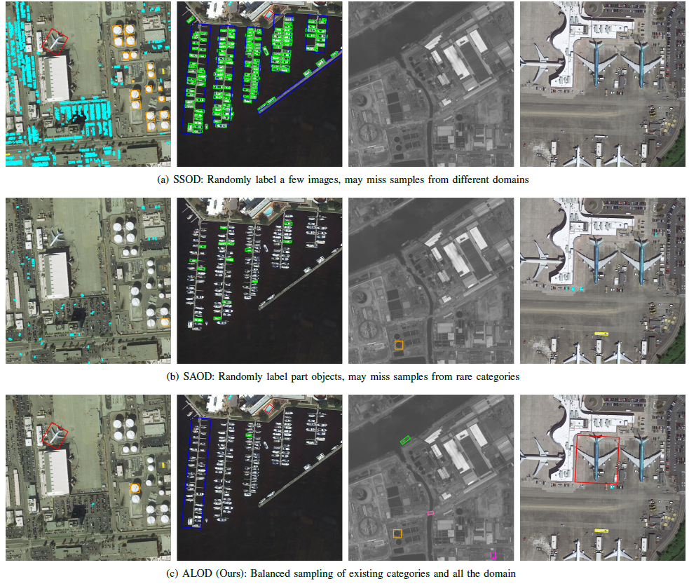
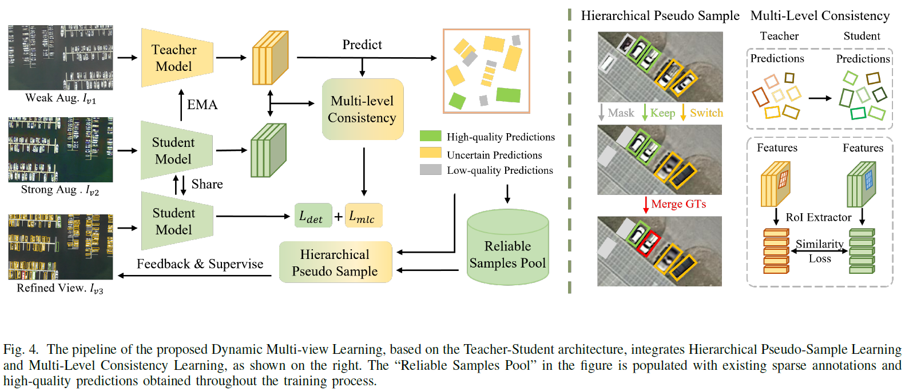
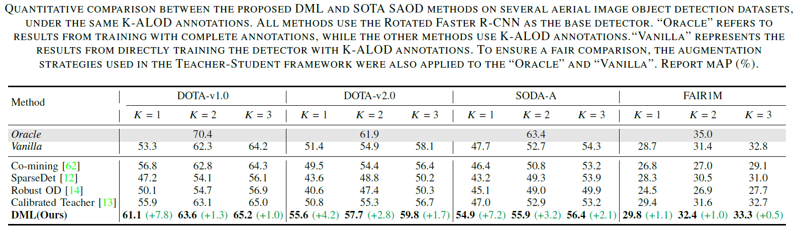
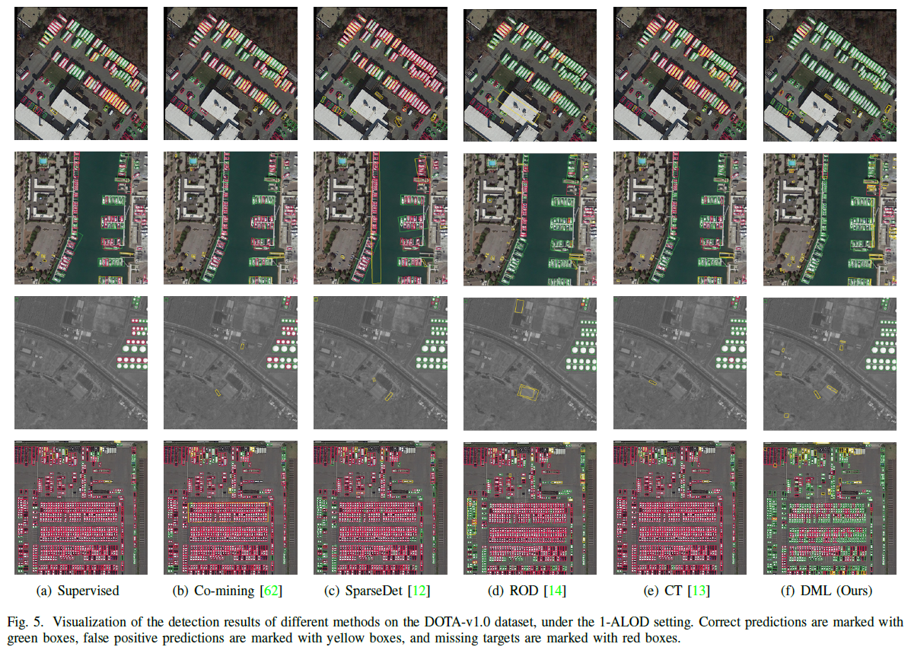

# ALOD_DML

This repo contains the codes for the TGRS paper: "Minimizing Sample Redundancy for Label-efficient Object Detection in Aerial Images"


## Introduction
In this paper, we propose a novel labeling pattern that acquires heterogeneous object labels in a class-orthogonal manner, called Attribute-aware labeling pattern for Label-efficient Object Detection in aerial images (ALOD).

<div align="center">
  
</div>

Meanwhile, we also propose a new learning pipeline under the ALOD labeling pattern, called Dynamic Multiview Learning (DML)

<div align="center">
  
</div>


## Requirements
- Python 3.7+
- PyTorch 1.13.1
- mmcv-full 1.7.0
- mmdet 2.25.3 ([https://github.com/open-mmlab/mmdetection](https://github.com/open-mmlab/mmdetection))
- mmrotate 0.3.3 ([https://github.com/open-mmlab/mmrotate](https://github.com/open-mmlab/mmrotate))
- CUDA 11.3+ (recommended for GPU acceleration)


## Installation
> ```bash
> cd thirdparty/mmdetection/
> pip install -v -e .
> cd ../mmrotate/
> pip install -v -e .
> cd ../../
> pip install -v -e 
> ```


## Dataset Preparation
### 1. Dataset Structure
First, follow the DOTA data format in MMrotate to crop large images. The final dataset folder structure should be:
> ```bash
> data/
> └── dota1/
>     ├── train_obb/
>     │   └── split_images/
>     │       ├── annfiles/  # Annotation files (*.txt)
>     │       └── images/    # Cropped image files
>     └── val_obb/
>         └── split_images/
>             ├── annfiles/
>             └── images/
> ```

### 2. Data Processing Scripts
Run the following commands to prepare the K-ALOD dataset and build the Reliable Samples Pool:
> ```bash
> # Step 1: Construct K-ALOD dataset from raw DOTA data
> python prepare_data_and_model/1_conduct_K-ALOD_dataset.py
>
> # Step 2: Crop object patches to build Reliable Samples Pool
> python prepare_data_and_model/2_cut_image_patches.py
> ```


## Pretraining
Before formal training, perform pretraining with the base detector and convert the model to T-S mode:
> ```bash
> # Step 1: Pretrain the base detector (using 1 GPU, adjust GPU number as needed)
> cd thirdparty/mmrotate
> ./tools/dist_train.sh configs/rotated_faster_rcnn/rotated_faster_rcnn_r50_fpn_for_alod.py 1
> # Step 2: Convert the pretrained base model to T-S (Teacher-Student) mode
>  
> cd ../../
> python prepare_data_and_model/generated_the_pretrained_T-S_model.py
> ```

## Training
Use the following command to start the formal training of the ALOD-DML model:
> ```bash
> # Train with 2 GPUs (adjust GPU number according to your device)
> bash ./tools/dist_train.sh configs/K_ALOD_dotav1/PLOD_v1_rofaster_dota1_1ins.py 2
> ```


## Quantitative Results
<div align="center">
  
</div>

The table above shows the quantitative performance of our ALOD-DML method compared with other state-of-the-art label-efficient object detection methods on the DOTA dataset.


## Visualization
<div align="center">
  
</div>

The figure above visualizes the detection results of our ALOD-DML method on aerial images, demonstrating its effectiveness in recognizing objects with different orientations and sizes.


## Citation
If you use this code or our work in your research, please cite our TGRS paper:
```bibtex
@article{ALOD_DML,
  author={Zhang, Ruixiang and Xu, Chang and Zhu, Haoran and Xu, Fang and Yang, Wen and Zhang, Haijian and Xia, Gui-Song},
  journal={IEEE Transactions on Geoscience and Remote Sensing}, 
  title={Minimizing Sample Redundancy for Label-Efficient Object Detection in Aerial Images}, 
  year={2025},
  volume={63},
  number={},
  pages={1-14},
  doi={10.1109/TGRS.2025.3562395}
}
```


## Acknowledgements
This project is built upon the following open-source libraries, and we sincerely appreciate their contributions:
- [MMdetection](https://github.com/open-mmlab/mmdetection): OpenMMLab object detection toolbox
- [MMrotate](https://github.com/open-mmlab/mmrotate): OpenMMLab rotated object detection toolbox
